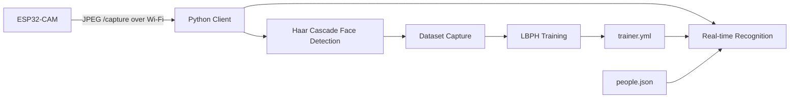

# ESP32-CAM LBPH Face Recognition

A small computer-vision project that captures face images from an ESP32-CAM, trains an OpenCV Local Binary Patterns Histograms (LBPH) recognizer, and performs real-time face recognition on frames retrieved over Wi-Fi.

The repository is a cleaned and privacy-safe version of an academic prototype. Real face images, trained biometric models, Wi-Fi credentials, and personal identifiers are intentionally excluded from the public repository.

## Features

- ESP32-CAM JPEG capture endpoint at `/capture`
- Face detection using OpenCV Haar Cascade
- Dataset collection with numeric user IDs
- LBPH model training with OpenCV Contrib
- Real-time recognition with configurable labels and threshold
- Unknown-face handling
- CLI configuration instead of hard-coded local paths and IP addresses
- Privacy-first repository structure for public GitHub use

## System Architecture



## Repository Structure

```text
.
├── config/
│   └── people.example.json
├── data/
│   └── dataset/
├── docs/
│   ├── GITHUB_UPLOAD.md
│   ├── PRIVACY.md
│   └── PROJECT_REPORT_SUMMARY.md
├── firmware/
│   └── esp32cam_capture/
│       ├── camera_pins.h
│       ├── esp32cam_capture.ino
│       └── secrets.h.example
├── models/
├── src/
│   ├── capture_dataset.py
│   ├── common.py
│   ├── recognize_faces.py
│   ├── train_model.py
│   └── validate_dataset.py
├── .editorconfig
├── .gitattributes
├── .gitignore
├── ATTRIBUTION.md
├── CONTRIBUTING.md
├── README.md
└── requirements.txt
```

## Requirements

Hardware:

- ESP32-CAM AI Thinker
- USB-to-serial programmer or compatible ESP32-CAM programmer
- Computer connected to the same Wi-Fi network as the ESP32-CAM

Software:

- Python 3.9 or newer recommended
- Arduino IDE with ESP32 board support
- Python dependencies from `requirements.txt`

The Python implementation requires `opencv-contrib-python`, not only `opencv-python`, because LBPH is exposed through the `cv2.face` module.

## Installation

Create and activate a virtual environment:

```bash
python -m venv .venv
```

Windows:

```bash
.venv\Scripts\activate
```

Linux or macOS:

```bash
source .venv/bin/activate
```

Install dependencies:

```bash
python -m pip install --upgrade pip
pip install -r requirements.txt
```

## ESP32-CAM Setup

1. Open `firmware/esp32cam_capture/esp32cam_capture.ino` in Arduino IDE.
2. Copy `secrets.h.example` to `secrets.h`.
3. Put your Wi-Fi SSID and password in `secrets.h`.
4. Select the AI Thinker ESP32-CAM board.
5. Upload the sketch.
6. Open Serial Monitor and note the printed capture URL.

Example:

```text
http://192.168.1.120/capture
```

`secrets.h` is ignored by Git and should never be committed.

## 1. Capture a Dataset

Collect face crops for one numeric identity:

```bash
python src/capture_dataset.py \
  --camera-url http://192.168.1.120/capture \
  --user-id 1 \
  --count 30
```

Repeat the command with another `--user-id` for each person.

Images are stored using this pattern:

```text
data/dataset/User.<ID>.<SEQUENCE>.jpg
```

Example:

```text
data/dataset/User.1.1.jpg
```

For better training data, capture multiple expressions and small pose changes while keeping the face clearly visible. Do not collect or publish face data without permission.

## 2. Validate the Dataset

Before training:

```bash
python src/validate_dataset.py
```

The validator checks file names, readable images, detected faces, and sample counts for each ID.

## 3. Train the LBPH Model

```bash
python src/train_model.py
```

The generated model is written to:

```text
models/trainer.yml
```

The `models/` directory is ignored by Git because a trained face model can contain biometric information derived from the dataset.

## 4. Configure Display Names

Copy:

```text
config/people.example.json
```

to:

```text
config/people.json
```

Then map numeric IDs to display labels:

```json
{
  "1": "Person One",
  "2": "Person Two",
  "3": "Person Three"
}
```

`people.json` is ignored by Git by default so personal labels are not accidentally published.

## 5. Run Real-Time Recognition

```bash
python src/recognize_faces.py \
  --camera-url http://192.168.1.120/capture
```

Press `Esc` or `q` to exit.

You can tune the LBPH distance threshold:

```bash
python src/recognize_faces.py \
  --camera-url http://192.168.1.120/capture \
  --threshold 60
```

With OpenCV LBPH, a lower distance indicates a closer match. The threshold therefore represents the maximum accepted distance, not a percentage accuracy value.

## Configuration with Environment Variable

Instead of repeating the camera URL, set:

```text
ESP32CAM_CAPTURE_URL=http://192.168.1.120/capture
```

Then run:

```bash
python src/capture_dataset.py --user-id 1
python src/recognize_faces.py
```

## Evaluation Note

The original academic demonstration compared two capture conditions:

- varied face angles, with displayed match-like values around 32% to 47%
- mostly frontal faces, with displayed values around 50% to 54%

These values came from a transformation of the LBPH prediction distance shown by the demo program. They are not a validated classification-accuracy metric because the project did not use a separate labeled test set and did not calculate metrics such as accuracy, precision, recall, or confusion matrices.

A more rigorous evaluation should split identities into training and test samples, keep test images separate from training, and report metrics on the held-out set.

See `docs/PROJECT_REPORT_SUMMARY.md` for the cleaned project summary.

## Privacy and Security

Face recognition projects handle biometric data. This repository therefore does not include:

- original face photographs
- trained `trainer.yml` files
- personal names used in the original prototype
- student identifiers
- Wi-Fi SSID or password
- the original report PDF because it embeds credentials and identifiable face images

Read `docs/PRIVACY.md` before using this project with real people.

## Limitations

- Haar Cascade and LBPH are lightweight classical computer-vision methods, not modern state-of-the-art face recognition.
- Recognition can degrade with pose, lighting, occlusion, camera quality, and dataset imbalance.
- The implementation is suitable for learning and controlled demonstrations. It should not be treated as a security-grade biometric authentication system.
- Network transport uses local HTTP. Do not expose the ESP32-CAM capture endpoint directly to the public internet.

## Acknowledgment

The dataset-training-recognition workflow is adapted from the educational OpenCV face-recognition project by Marcelo Rovai, with additional modifications for ESP32-CAM image capture, unknown-face handling, portability, privacy, and repository hygiene. See `ATTRIBUTION.md`.

## Suggested GitHub Metadata

Repository name:

```text
esp32cam-lbph-face-recognition
```

Description:

```text
Real-time face recognition with ESP32-CAM, OpenCV Haar Cascade, and LBPH in Python.
```

Suggested topics:

```text
esp32-cam opencv python face-recognition lbph computer-vision iot haar-cascade
```
